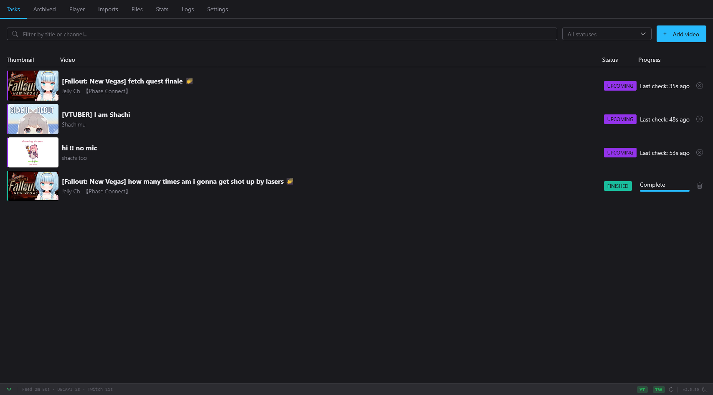
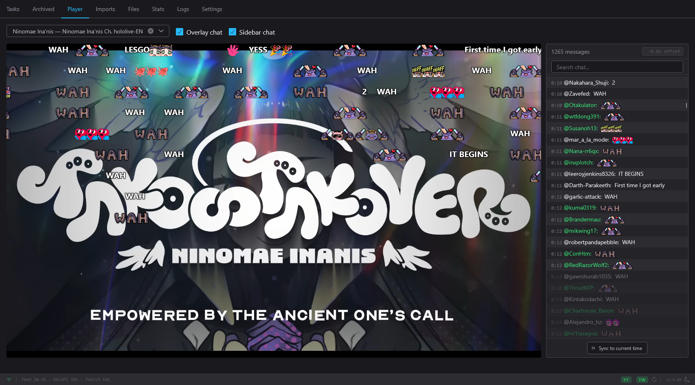
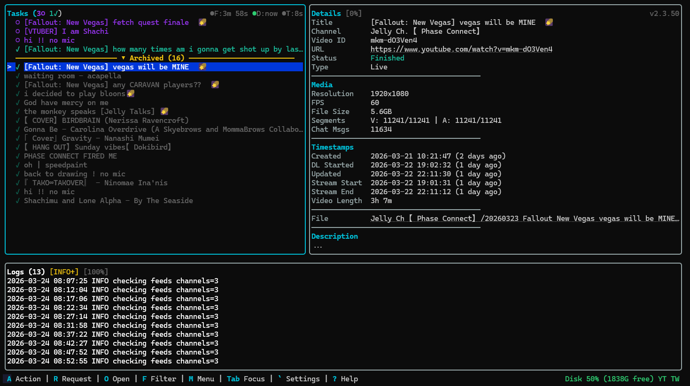

# Moombox

> **Note:** This project was 99% written by [Claude](https://claude.ai) (Anthropic's AI model) using [Claude Code](https://claude.ai/code). From architecture decisions to implementation details, the vast majority of the codebase — including the YouTube engine, download pipeline, TUI, web dashboard, BotGuard solver, and this README — was generated through AI-assisted development.

YouTube and Twitch live stream archiver with a terminal UI and web dashboard. Monitors channels, detects live streams, and downloads video + live chat automatically.

Written in Go. Single binary, no runtime dependencies beyond FFmpeg.

I kept the Moom because of Nanashi Mumei being my oshi. I might change it to a different name related to a certain orca in time, but for now, it's just Moombox.

## Screenshots

### Web Dashboard


### Video Player with Chat Replay


### Terminal UI


## Features

### Core
- **YouTube + Twitch** — Monitors and downloads live streams from both platforms
- **Channel monitoring** — Independent RSS feed polling (YouTube), DECAPI polling (YouTube), and GQL polling (Twitch) with regex filtering on titles and descriptions
- **Live stream archiving** — Downloads DASH/HLS video segments in real-time with automatic parallel catch-up when falling behind
- **Live chat capture** — Archives chat alongside video (YouTube live chat + Twitch IRC), including pre-stream messages from the waiting room
- **VOD downloads** — Download regular videos and post-live DVR recordings with parallel segment fetching
- **Resume on crash** — Periodic state saves allow resuming interrupted downloads without data loss
- **Parallel downloads** — Process multiple streams simultaneously with configurable concurrency
- **Quality monitoring** — Probes stream quality every 30 seconds during live downloads. If the resolution or framerate changes mid-stream, automatically muxes the current segment and starts a new one — no data lost, no mismatched frames

### Advanced Download Options
- **Manual format selection** — Choose specific video and audio formats per download, or select "None" for video-only/audio-only
- **Timestamp selection** — Download a specific time range of a stream (start/end time), with frame-accurate trimming via FFmpeg re-encode
- **Post-download trimming** — Create trimmed clips from finished downloads with CRF-based encoding for optimal quality/size
- **60fps support** — Prefers 60fps streams when available at the same resolution

### Updates
- **Auto-updater** — Checks GitHub for new releases and downloads updates in-place. Apply updates from the web dashboard or TUI — the app restarts automatically with the new version
- **Launcher/supervisor** — A lightweight launcher process manages the app lifecycle. Config changes, updates, and setup wizard restarts are seamless — no terminal flicker, no process chain buildup

### Security
- **HTTPS support** — Auto-generated self-signed certificates with dual-protocol (TLS + plain HTTP) on a single port
- **Password authentication** — Optional password protection for external access (scrypt-hashed, session-based)
- **Reverse-proxy aware** — `trusted_proxies` makes IP-based access control judge the real client behind nginx/Caddy/Traefik instead of the proxy (see [Remote Access](#remote-access))

### Authentication
- **Member-only support** — Cookie-based authentication for members-only streams (YouTube + Twitch)
- **Automatic cookie refresh** — Keeps sessions alive with periodic background refresh with real API-based validation
- **Auto cookie setup** — Launch a browser from the dashboard or TUI, log in, and cookies are extracted automatically (Firefox recommended, Chromium supported)
- **Auto-reacquisition** — When cookies expire or are deleted, Moombox automatically re-launches the browser to reacquire them

### Interfaces
- **Terminal UI** — Full-screen TUI built with [Charmbracelet's Bubble Tea suite](https://github.com/charmbracelet) ([Bubble Tea](https://github.com/charmbracelet/bubbletea) + [Bubbles](https://github.com/charmbracelet/bubbles) + [Huh](https://github.com/charmbracelet/huh) + [Lip Gloss](https://github.com/charmbracelet/lipgloss)) with mouse support, keyboard navigation, job management, settings editor, and live logs
- **Web dashboard** — Real-time job monitoring at `localhost:774` (HTTPS when external) with video player, synchronized chat replay (Niconico-style flying overlay + sidebar), settings management, and zip import
- **Mobile responsive** — Web dashboard adapts to tablets and phones with reorganized layouts and touch-friendly controls
- **Statistics dashboard** — At-a-glance disk usage, total archive size, platform breakdown (YouTube vs Twitch), job counts, and activity metrics
- **First-run wizard** — Built-in setup wizard in both TUI and web dashboard for initial configuration (quick mode or 8-step advanced walkthrough)
- **Process restart** — Restart Moombox from the TUI or web dashboard when settings require it

### Integration
- **Native PO Token generation** — Built-in BotGuard solver using [Goja](https://github.com/dop251/goja) (pure-Go JavaScript engine, no CGo or V8)
- **yt-dlp compatibility** — Built-in PO Token HTTP endpoint and bundled yt-dlp plugin
- **YouTube cipher decryption** — Native implementation of signature and n-parameter decryption via Goja
- **Webhook notifications** — Notifications for stream events via any webhook-compatible service (Discord, Slack, ntfy, etc.)
- **Single binary** — Compiles to a single executable with embedded web assets, no external runtime dependencies
- **Built-in FFmpeg installer** — Install FFmpeg via Chocolatey or Winget directly from the setup flow, with UAC elevation support and script review for non-admin users

## Requirements

**Running the pre-built executable:**
- Windows x64, **or** Linux x64, **or** Linux arm64
- [FFmpeg](https://ffmpeg.org/download.html) in your PATH (for muxing video + audio)

**Running with Docker:**
- Docker (x64 or arm64 host) — FFmpeg is included in the image

**Building from source:**
- [Go](https://go.dev/dl/) 1.25 or later
- [FFmpeg](https://ffmpeg.org/download.html) in your PATH

## Quick Start

### Windows

1. Download `Moombox.exe` from the [latest release](https://github.com/vampiricwulf/Moombox/releases/latest)
2. Place it in a directory of your choice
3. Run `Moombox.exe`

### Linux (x64)

```bash
wget https://github.com/vampiricwulf/Moombox/releases/latest/download/moombox-linux-amd64
chmod +x moombox-linux-amd64
./moombox-linux-amd64
```

### Linux (arm64)

```bash
wget https://github.com/vampiricwulf/Moombox/releases/latest/download/moombox-linux-arm64
chmod +x moombox-linux-arm64
./moombox-linux-arm64
```

A built-in setup wizard walks you through first-time configuration on launch. The TUI opens by default — press **W** to open the web dashboard in your browser.

### Docker (x64 / arm64)

```bash
mkdir moombox && cd moombox
wget https://raw.githubusercontent.com/vampiricwulf/Moombox/main/docker-compose.yml
docker compose up -d
```

The dashboard is available at `http://<host>:774`. Everything (config,
database, logs, staging, finished downloads) lives under `./data`; edit
`./data/config.toml` or use the dashboard's Settings page to configure.

Docker-specific behavior:
- **Network access defaults to `"lan"`** (instead of `"localhost"`) — the
  container is only reachable through the published port, and requests
  arriving over Docker's bridge network are never loopback, so a
  `"localhost"` default would make the dashboard unreachable. Use
  `"127.0.0.1:774:774"` as the port mapping to restrict access to the
  Docker host only. The compose file also declares an IPv6-enabled
  network — reach the dashboard over the host's **IPv4** address (see
  [Remote Access](#remote-access) and the comments in
  `docker-compose.yml`).
- The first-run setup wizard is skipped (the entrypoint seeds a config
  on first start); all of its settings are available in Settings.
- For members-only content, put a Netscape cookie file at
  `./data/cookies.txt` on the host — the `./data` volume already exposes
  it and the seeded config points at `/data/cookies.txt`, so there is no
  extra volume line to add. **Do not bind-mount the file individually**
  (`- ./cookies.txt:/data/cookies.txt`): Moombox keeps the YouTube
  session alive by rewriting `cookies.txt` about every 30 minutes with
  the values YouTube rotates back, and it does so with a temp file plus a
  rename. A rename cannot replace a single-file bind mount, so the
  write-back fails with only a warning in the log and the session quietly
  ages out. When the session does die, open Settings → Cookies
  in the dashboard and paste (or upload) a fresh Netscape export: Moombox
  merges it into `cookies.txt`, reloads it immediately and tells you whether
  it authenticates. Overwriting `./data/cookies.txt` on the host works too and
  takes effect within 30 minutes, or right away if you press "Refresh
  cookies". The interactive browser login in Settings needs a headed browser
  and a person at it, so it is not an option here. Export from a private
  window and close that window afterwards: continuing to browse in the
  source profile rotates the session and invalidates the export.
- Alternatively, mount a **Firefox profile directory** into the `./data`
  volume as `./data/browser-profile`. Moombox reads `cookies.sqlite` out
  of it directly — no browser process involved, and nothing is written
  back into the profile — and writes what it finds into `cookies.txt`.
  Close Firefox before copying the profile, and copy `cookies.sqlite`
  together with any `cookies.sqlite-wal` beside it; the main file alone
  can read as empty. Leave `auto_enabled` off: it only starts a
  headless-browser refresh timer, and the image has no browser. A first
  start with no `cookies.txt` imports the profile on its own; after that
  the profile is read when **you** ask for it — the Settings page's
  "Refresh cookies from browser profile" button, shift+click on the
  header's "Refresh cookies", or `R F` in the TUI —
  because nothing inside the container changes the profile, so nothing
  else can know when there is something new to read. See
  [Cookie Setup](#cookie-setup).
- Update by pulling a new image (`docker compose pull && docker compose
  up -d`) — an in-app update would be lost when the container is
  recreated, so the seeded config disables automatic update checks
  (`auto_check_updates = false`; the manual "Check for updates" button
  still works).

To build the image from source instead of pulling:
`docker build -t moombox .` from a checkout of this repository.

To add a video manually:
```bash
Moombox.exe add <video_url_or_id>
```

To run without the TUI (web dashboard only):
```bash
Moombox.exe --no-tui
```

Other flags:
```bash
Moombox.exe --version          # Show version and exit
Moombox.exe --config path.toml # Use a specific config file
Moombox.exe --log-level DEBUG  # Override log level
```

## Remote Access

Out of the box Moombox is reachable only from the machine it runs on
(`network_access = "localhost"`). The Docker image seeds `"lan"` instead,
because requests arriving through a published port come over Docker's
bridge network and never look like loopback. In both cases the dashboard
has no password and needs none — the IP filter is the boundary, and
loopback/private clients always skip authentication.

To reach the dashboard from outside that boundary, pick one of these —
strongest first.

### 1. VPN / Tailscale (recommended)

Put the host on a tailnet or WireGuard network and change nothing in
Moombox. VPN clients arrive with private addresses, so they pass the
`lan` filter as if they were on the LAN. No open ports, no password to
manage, and network membership is the authentication.

### 2. Reverse proxy with HTTPS

Terminate TLS at nginx/Caddy/Traefik and forward to Moombox. In
`[network]`:

```toml
network_access = "external"
trusted_proxies = ["172.18.0.2"]  # the proxy's address — as narrow as possible
trust_forwarded_proto = true      # proxy terminates TLS; Moombox sees plain HTTP
```

`trusted_proxies` is what makes this safe. Without it every forwarded
request is judged by the *proxy's* address — private or loopback, and
trusted either way — so internet traffic passes the `lan` filter and
skips authentication. With it, Moombox reads `X-Forwarded-For` (and only
from that peer) and applies the IP gate, the auth skip, and rate limiting
to the real client. Changes take effect immediately; no restart.

Declare the narrowest thing that works — the single proxy address, not a
`/16`. Anything inside a declared range is trusted to state who the
client is, including claiming a loopback address. That is inherent to
trusting a range, so keep the range small.

Configure the proxy to **append to** (or replace) `X-Forwarded-For` —
never to forward the client's header unchanged. Moombox trusts the
rightmost entry the proxy did not vouch for, which is safe only because
the proxy writes the address it actually saw to the right of whatever the
client sent. A bare pass-through makes the client's own value the
rightmost entry and reopens exactly the bypass this setting closes. In
nginx use `proxy_set_header X-Forwarded-For $proxy_add_x_forwarded_for;`
(or `$remote_addr` to replace); Caddy and Traefik append by default.
Either append style works — extending the existing header line or adding
a second `X-Forwarded-For` line (HAProxy's `option forwardfor`) — since
Moombox reads every line of the header, not just the first.

The address to declare is the one **Moombox actually sees**, which is not
always the proxy's own IP:

- Proxy on the Docker host, connecting to `127.0.0.1:774` — the
  connection is relayed by `docker-proxy`, so the peer address is the
  bridge gateway (`docker network inspect <network>` reports it, commonly
  `172.17.0.1`).
- Proxy as a container on a shared Docker network — the peer address is
  that container's address on the network.
- Moombox running directly on the host — the peer address is the proxy's
  own IP, or `127.0.0.1` if both are on the same machine.

When unsure, configure `trusted_proxies` last: while it is empty, any
Moombox log line that records a client address (the `[Auth]` login lines,
for example) shows the direct peer — exactly the value to declare.

Note that `network_access` must be `external`/`public` here, not `lan`.
Once `trusted_proxies` resolves the real client, that client is an
internet address — the `lan` filter would 403 it, which is the whole
point of resolving it.

Then choose where authentication happens:

- **Moombox authenticates** — set a dashboard password and keep
  `network_access = "external"`. Remote clients get the login page;
  loopback and private clients still skip it. Set the password *before*
  switching Network Access — see "Direct exposure" below for why, and for
  how to set the first password inside a container.
- **The proxy authenticates** — set `network_access = "public"` in
  `config.toml`. It behaves identically to `"external"` and exists to
  label this deployment; it is deliberately absent from the Settings
  dropdowns and rejected by the config API, because it is only meaningful
  behind an authenticating proxy. With no dashboard password, Moombox
  logs a startup warning and shows a red banner in the dashboard and the
  TUI — on purpose, because it cannot verify that your proxy really does
  authenticate. Setting a Moombox password as well clears the warning and
  gives you a second lock.

Either way, make the proxy the **only** route to Moombox's port: publish
it as `127.0.0.1:774:774`, or put the proxy and Moombox on a shared
Docker network and don't publish the port at all. A directly reachable
port defeats both the proxy's authentication and `trusted_proxies`.

### 3. Direct exposure

Set a dashboard password first, then `network_access = "external"` and
`https_enabled = true`.

That order is enforced: the web dashboard, the TUI, the config API, and
the setup wizard all refuse to enable external access while no password
is set, and removing the password drops `network_access` back to
`"localhost"` in the same write.

Setting the *first* password inside a container needs a workaround —
first-time password setup requires a loopback connection, and requests
through Docker's bridge are never loopback. Put the plaintext password in
`/data/config.toml` and restart the container:

```toml
[network]
password_hash = "your-password-here"
```

Moombox detects that this is not a scrypt hash, converts it, and writes
the hash back on the next start — the plaintext only sits in the file
until then.

If a hand-edited config ends up on `external`/`public` with no password,
Moombox still boots — it logs a warning, reports `passwordlessExternal`
on `/api/auth/status`, and shows a persistent red banner in both UIs. It
never refuses to start, so an existing deployment fronted by an
authenticating proxy keeps working.

### Docker caveats

- **Docker Desktop (Windows/macOS)** proxies every inbound connection
  through its VM, so Moombox sees all clients as the private gateway
  address and the `lan` filter cannot tell them apart. There, the port
  publish is the only exposure control — keep it host-only or
  LAN-firewalled.
- **Published ports bypass `ufw`/`firewalld`** on Linux: Docker inserts
  its own DNAT rules, so a host firewall rule does not cover a published
  port. Restrict the publish itself (`127.0.0.1:774:774`) rather than
  relying on the firewall.
- **IPv6.** Moombox binds IPv4 only. `docker-compose.yml` declares an
  IPv6-enabled network so that inbound IPv6 to the published port is
  handled by ip6tables instead of Docker's userland proxy — which would
  otherwise re-originate those connections from the bridge gateway's
  *private IPv4* address, making an internet IPv6 client look like a LAN
  client to the `lan` filter. The practical effect is that IPv6
  connections are refused at the container rather than misclassified:
  **reach the dashboard over the host's IPv4 address.** A hostname with
  an AAAA record generally still works, since browsers fall back to IPv4
  after the refusal. This relies on Docker Engine 27+, where ip6tables is
  enabled by default; on older engines the misclassification remains and
  nothing in Moombox can detect it. Publishing as `0.0.0.0:774:774` stops
  the port accepting IPv6 in the first place. See the comments in
  `docker-compose.yml`, including what to do if your host cannot create
  an IPv6-enabled network at all.

## Configuration

Moombox includes a built-in first-time setup wizard — no manual configuration is necessary. All settings can be changed at any time from the **Settings** page in the web dashboard or TUI.

For advanced users, a [`config.example.toml`](config.example.toml) reference is included. Moombox looks for `config.toml` in the current directory, `./config/`, or `~/.config/moombox/`.

### Key Settings

| Setting | Default | Description |
|---------|---------|-------------|
| `port` | `774` | Web dashboard port |
| `network_access` | `"localhost"` | `"localhost"`, `"lan"`, `"external"`, or `"public"` — `"public"` behaves like `"external"` and is only settable in `config.toml` ([Remote Access](#remote-access)) |
| `trusted_proxies` | `[]` | Reverse-proxy IPs/CIDRs whose `X-Forwarded-For` is honored ([Remote Access](#remote-access)) |
| `log_level` | `"INFO"` | `"DEBUG"`, `"INFO"`, `"WARN"`, `"ERROR"` |
| `downloader.max_video_resolution` | `1080` | Max resolution (based on max of width/height, handles portrait) |
| `downloader.cookie_file` | `"./cookies.txt"` | Netscape-format cookie file |
| `downloader.download_chat` | `true` | Download live chat alongside streams |
| `downloader.prefer_60fps` | `true` | Prefer 60fps when same resolution available |
| `downloader.num_parallel_downloads` | `2` | Simultaneous download jobs |
| `downloader.output_template` | `"${channel}/${start_date} ${title} [${id}]"` | Output path template |
| `feed_check_interval` | `10` | Minutes between RSS feed checks (also accepts `"10m"`) |
| `twitch_check_interval` | `15` | Seconds between Twitch GQL live-status checks (with jitter) |
| `tasklist.hide_finished_age_days` | `30` | Days before finished jobs move to Archived (also accepts `"30d"`) |
| `memory.go_soft_limit_mb` | `256` | Soft memory cap for the Go process (no OOM; just GC pressure as memory approaches it) |
| `memory.sidecar_soft_limit_mb` | `200` | RSS threshold at which Moombox tells the sidecar to run a full V8 GC |
| `memory.sidecar_hard_limit_mb` | `512` | Sidecar V8 `--max-old-space-size` ceiling (does OOM if hit; set well above the soft cap) |

### Channel Monitoring

```toml
# YouTube channel
[[channels]]
id = "UCxxxxxxxxxx"                   # YouTube channel ID
name = "Channel Name"                 # Display name (optional)
terms = "(?i)karaoke|singing"         # Regex filter on title + description (optional)
include_non_live_content = false       # Also download regular uploads (default: false)
enabled = true                        # Toggle monitoring on/off (default: true)

# Twitch channel
[[channels]]
id = "channelname"                    # Twitch login name
name = "Channel Name"
platform = "twitch"                   # Required for Twitch channels
quality_preference = "best"            # "best", "720p", "480p", or "audio_only"
```

Template variables for `output_template`: `${title}`, `${id}`, `${channel}`, `${start_date}`, `${start_time}`

## Building from Source

See [BUILDING.md](BUILDING.md) for prerequisites and build commands for Windows, Linux x64, and Linux arm64.

## Terminal UI

The TUI displays a three-panel layout: task list + job details (top) and live log viewer (bottom). Tab switches focus between panels — the focused panel expands to take more space.

### Keyboard Controls

The TUI uses a two-key chord system. Press a prefix key, then the action key within 3 seconds. Confirm-required actions (marked with ×2) need a third keypress.

**Action (A)**

| Chord | Action |
|-------|--------|
| A A | Add video |
| A I | Import archive |
| A R | Retry failed/cancelled job |
| A C C | Cancel active job (confirm) |
| A D D | Delete job (confirm) |
| A T | Trim finished video |
| A O | Browse orphaned files |
| A K | Manage client tokens |

**Request (R)**

| Chord | Action |
|-------|--------|
| R C | Recheck cookie authentication |
| R F | Force browser cookie refresh |
| R V | Check for updates |
| R N | View release notes for pending update |
| R U | Apply pending update |
| R P P | Restart program (confirm) |

**Open (O)**

| Chord | Action |
|-------|--------|
| O F | Open output/staging folder |
| O S | Open stream page in browser |
| O W | Open web dashboard |

**Quick Keys**

| Key | Action |
|-----|--------|
| F | Cycle status filter (All/Active/Errors/Finished) |
| M | Open action menu |
| Q Q | Quit |
| Ctrl+C | Quit immediately |
| Tab | Switch focus between Tasks/Details/Logs |
| ` | Open settings |
| ? | Toggle help overlay |

**Navigation**: Up/Down to select/scroll, PgUp/PgDn for log pages, Enter to expand/collapse archives. Mouse support: click to select tasks, scroll wheel to navigate.

### Add Video Dialog

Press **A A** to open the Add Video dialog. By default it's in quick-add mode — paste a URL and press Enter. Press **Tab** to cycle through modes:

- **Quick Add** — Paste a YouTube or Twitch URL and press Enter
- **Advanced** — 5-step wizard: URL, Video Format, Audio Format, Timestamps, Confirm
- **Import** — Upload a `.zip` archive with video + optional chat JSON

## Web Dashboard

Available at `http://localhost:774` (auto-upgrades to HTTPS for external access) with:

- **Tasks tab** — Real-time job list with progress bars, add/cancel/retry/delete actions, and job details with embedded YouTube player
- **Advanced Options** — Format selection (video/audio dropdowns with codec badges) and timestamp range when adding videos
- **Archived tab** — Browse finished jobs older than `hide_finished_age_days`
- **Player tab** — Replay archived videos with synchronized chat:
  - Niconico-style flying chat overlay (togglable)
  - Sidebar chat panel with auto-scroll and search (togglable)
  - Superchat highlighting and emoji support
  - Multi-segment playback with cross-segment seeking for quality-split recordings
- **Imports tab** — Upload `.zip` archives containing video + optional chat JSON for playback in the Player tab
- **Stats tab** — Disk usage, archive size, platform breakdown, job counts, and recent activity
- **Logs tab** — Live log viewer
- **Settings** — General config, downloader settings, channel management (YouTube + Twitch), webhook notifications, password security, yt-dlp plugin installation, and auto-cookie setup

### API

All endpoints are available under `/api/`. Real-time updates are delivered via WebSocket at `/ws`.

| Method | Endpoint | Description |
|--------|----------|-------------|
| GET | `/api/jobs` | List active jobs (supports pagination) |
| GET | `/api/jobs/archived` | List archived jobs |
| GET | `/api/jobs/{id}` | Get job details |
| GET | `/api/jobs/{id}/video` | Stream video file (Range requests supported) |
| GET | `/api/jobs/{id}/chat` | Get chat data |
| GET | `/api/formats/{videoId}` | Get available formats for a video |
| POST | `/api/jobs` | Add new job |
| POST | `/api/jobs/{id}/cancel` | Cancel job |
| POST | `/api/jobs/{id}/retry` | Retry failed job |
| DELETE | `/api/jobs/{id}` | Delete job |
| POST | `/api/jobs/{id}/trims` | Create trimmed clip |
| POST | `/api/import` | Import zip archive |
| GET | `/api/config` | Get configuration |
| PUT | `/api/config` | Update configuration |
| GET | `/api/status` | Server status |
| POST | `/api/restart` | Restart server (authorized clients per `network_access` + auth) |
| POST | `/api/auth/login` | Authenticate with password |
| POST | `/api/auth/set-password` | Set or change password |
| GET | `/api/auth/status` | Check auth status |
| GET | `/api/ffmpeg/check` | Check if FFmpeg is available |
| POST | `/api/ffmpeg/install` | Install FFmpeg via package manager |
| GET | `/api/update/status` | Check for available updates |
| POST | `/api/update/apply` | Download and apply update |
| GET | `/api/stats` | Get download statistics |

WebSocket messages: `initial_state`, `jobs_update`, `job_update`, `check_timers`, `log`, `pong`

## yt-dlp Integration

Moombox includes a built-in PO Token HTTP endpoint compatible with yt-dlp.

### Using the HTTP endpoint directly

```bash
yt-dlp --extractor-args "youtube:player-client=web;po_token=web.gvs+http://127.0.0.1:774/get_pot" <URL>
```

### Using the bundled plugin

The yt-dlp plugin can be installed from the web dashboard's Settings > Integrations page.

### POT Provider Endpoints

| Method | Endpoint | Description |
|--------|----------|-------------|
| POST | `/get_pot` | Generate PO token (loopback only) |
| POST | `/invalidate_caches` | Clear all caches (loopback only) |
| POST | `/invalidate_it` | Invalidate integrity tokens (loopback only) |
| GET | `/ping` | Health check |

## Cookie Setup

Cookies are needed for member-only content (YouTube) and authenticated access (Twitch). Three options:

### Automatic (recommended on a desktop)

Use the web dashboard Settings page or TUI settings panel to launch a browser, log into YouTube and/or Twitch, and Moombox stores the result in an isolated profile of its own. Firefox is recommended (cookies are read directly from SQLite). Edge and Chrome are supported as fallback via Chrome DevTools Protocol. That setup runs whatever `auto_enabled` says — it is how you supply cookies, not something the flag switches on.

Then, on a desktop, turn the flag on:

```toml
[cookies]
auto_enabled = true
browser_profile_dir = "./browser-profile"
```

`auto_enabled` governs exactly two things: a slow second refresh that re-opens that profile in a headless browser on a timer, and one automatic browser attempt when authentication fails (with it off, Moombox notifies you instead). Everything else runs either way — the in-process refresh that keeps the YouTube session alive is gated only on `cookie_file`, and so is the manual re-import described below. Changing the flag takes effect on restart.

### Browser profile import (headless hosts and Docker)

If no supported browser is installed — the Docker image ships none — Moombox
reads a Firefox profile directory you point it at, with no browser launch and
no writes into the profile. This needs **no config beyond `cookie_file`**:

```toml
[cookies]
cookie_file = "/data/cookies.txt"
```

Leave `auto_enabled` off here. It only starts the headless-browser refresh
timer and allows one automatic browser attempt on auth failure, and there is
no browser on such a host to run either; it has never gated the import.

`browser_profile_dir` needs no entry: it defaults to `./browser-profile`,
which resolves to `/data/browser-profile` inside the container. Mount or copy
in the **single** Firefox profile directory there (the one containing
`prefs.js` and `cookies.sqlite`), not its parent.

**The first import is automatic.** On a start where there is no `cookies.txt`
yet, Moombox reads the mounted profile once, shortly after boot — there is
nothing on disk to lose. Mount a profile and start; you do not have to press
anything.

**After that, you trigger it.** Press **"Refresh cookies from browser
profile"** on the dashboard's Settings page (under Automatic Cookie Login) —
or shift+click the header's "Refresh cookies" button, or press `R F` in the
TUI. All three read straight from the profile with no browser, whatever
`auto_enabled` says and whatever `cookies.txt` already holds. Use the Settings
button on a phone or tablet: shift+click needs a keyboard.
Moombox does not re-read the profile on a timer once you have cookies,
deliberately: nothing on the host side of the mount changes it, so a timer
would re-read identical bytes over credentials that may still be working. When
the session ages out, refresh the profile and press the button. Between
imports the in-process refresh keeps the imported YouTube session alive on its
own.

Copy the profile with Firefox **closed**, and bring `cookies.sqlite-wal` along
with `cookies.sqlite` if you copy the files individually — recent cookies live
in that sidecar, and a copy without it looks valid while containing nothing.
(`cookies.sqlite-shm` is rebuilt automatically and does not need copying.)

Two honest limits, so you know what this does and does not buy you:

- Importing refreshes whatever the **profile** holds. It cannot renew
  `SAPISID` / `LOGIN_INFO` — YouTube only rotates those through a browser JS
  challenge Moombox cannot execute. Eventually you will need to re-export.
- A profile still in use by a live browser session will have its exported
  cookies invalidated by that session's own activity. Dedicate a profile to
  Moombox rather than sharing your daily driver.

### Paste or upload (any host, no browser, no volume access)

The dashboard's Settings → Cookies panel takes a Netscape `cookies.txt`
directly: paste the text, or choose the file. Moombox **merges** it into
whatever `cookies.txt` already holds — a YouTube-only export leaves your Twitch
session alone, and vice versa — reloads it into the running process, and answers
with what a live check concluded, so a bad export is reported while you are
still looking at it rather than at the next members-only stream.

This is the re-authentication path for a container, and for any instance you
reach over the network or from a phone: it needs no browser on the host and no
access to the data volume. Jobs parked in `COOKIES?` resume on their own once
the credentials check out.

Export from a **private window** and close it afterwards: continuing to browse
in the source profile rotates the session and invalidates the export. Moombox
never serves cookies back — there is no download, by design.

### Manual

Export cookies in Netscape format from your browser and save as `cookies.txt`:

```toml
[cookies]
cookie_file = "./cookies.txt"
```

## Webhook Notifications

Send webhook notifications for stream events:

```toml
[[notifications]]
url = "https://discord.com/api/webhooks/YOUR_ID/YOUR_TOKEN"
events = ["live", "finished", "error"]  # Optional filter (default: all events)
```

Available events: `found`, `added`, `scheduled`, `live`, `downloading`, `muxing`, `finished`, `error`, `auth`, `cancelled`

## Job Status Flow

```
Upcoming -> Live -> Downloading -> Muxing -> Finished
```

Special states: `Error`, `Cancelled`, `COOKIES?` (member content needs cookie refresh)

## Architecture

Moombox is a Go application (~37,000 lines) compiled to a single binary. All code lives under `internal/` with web assets embedded via `go:embed`.

```
Monitors (RSS/DECAPI/Twitch) -> Job Database (SQLite) -> Download Worker -> YouTube/Twitch API
                                                                |
                                 Web Dashboard <- FFmpeg Muxer <- Segment Downloads (DASH/HLS/VOD)
                                 (localhost:774)      |
                                                Chat Downloader (YouTube live chat / Twitch IRC)
```

Key components:
- **YouTube engine** — Multi-client Innertube API strategy. Cipher (sig + n) and BotGuard PO Token solving primarily flow through an embedded Node + V8 sidecar that wraps [yt-dlp/ejs](https://github.com/yt-dlp/ejs) (vendored, public-domain) and [bgutils-js](https://github.com/LuanRT/BgUtils). An in-process [Goja](https://github.com/dop251/goja) implementation serves as a fallback when the sidecar is disabled or down.
- **Twitch engine** — GQL-based stream metadata, HLS segment downloading, IRC live chat, and VOD chat replay
- **Download pipeline** — SegmentDownloader with parallel catch-up mode (6 concurrent segments), head sequence tracking, resume state, and gap detection
- **Chat system** — YouTube live chat polling + Twitch IRC with memory bounding, stale continuation recovery, and replay support
- **Database** — SQLite with WAL mode, batch updates, and pub/sub for real-time UI updates
- **Web server** — [chi](https://github.com/go-chi/chi) router with WebSocket real-time updates, CORS, CSP, rate limiting, password auth, and IP-based access control
- **TUI** — Built on [Charmbracelet's full Bubble Tea suite](https://github.com/charmbracelet): [Bubble Tea](https://github.com/charmbracelet/bubbletea) framework, [Bubbles](https://github.com/charmbracelet/bubbles) components, [Huh](https://github.com/charmbracelet/huh) forms, and [Lip Gloss](https://github.com/charmbracelet/lipgloss) styling

See [CLAUDE.md](CLAUDE.md) for comprehensive architecture documentation including initialization order, package dependency graph, code patterns, and design decisions.

## License

[MIT](LICENSE)

Based on [nosoop/moombox](https://github.com/nosoop/moombox).
